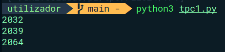

# TPC1 - Somador on/off 

# João Carvalho, A94015

## Resumo

Para este trabalho foi-nos proposto a implementação de um programa em Python que funcionasse como um somador on/off. O objetivo era somar números de um texto de entrada, respeitando comandos que ativavam ou desativavam a soma.

Para a realização desta tarefa, o programa deveria:

1. Ler um texto de entrada contendo números e comandos;

2. Interpretar os comandos "on" e "off", que ativavam ou desativavam a soma;

3. Somar apenas os números encontrados enquanto o modo "on" estivesse ativo;

4. Exibir o resultado final da soma.

A implementação foi feita sem o uso de expressões regulares, utilizando apenas manipulação de strings e controle de fluxo básico em Python, a string foi passada como argumento para a função.

## Resultado

A resolução pode ser encontrada em [GitHub](https://github.com/joodanic/PL2024/blob/main/TP1/tpc1.py).

**Resultado:**
