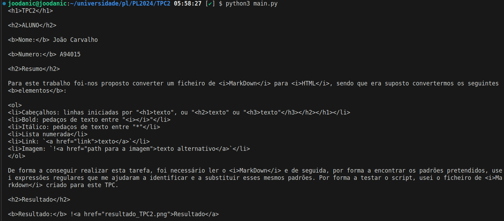

# TPC3 Conversor de MarkDown para HTML

## ALUNO

**Nome:** João Carvalho

**Numero:** A94015

## Resumo

Para este trabalho foi-nos proposto converter um ficheiro de *MarkDown* para *HTML*, sendo que era suposto convertermos os seguintes **elementos**:

1. Cabeçalhos: linhas iniciadas por "# texto", ou "## texto" ou "### texto"
2. Bold: pedaços de texto entre "**"
3. Itálico: pedaços de texto entre "*"
4. Lista numerada
5. Link: `[texto](link)`
6. Imagem: ``

De forma a conseguir realizar esta tarefa, foi necessário ler o *MarkDown* e de seguida, por forma a encontrar os padrões pretendidos, usei expressões regulares que me ajudaram a identificar e a substituir esses mesmos padrões. Por forma a testar o script, usei o ficheiro de *Markdown* criado para este TPC.

## Resultado

O Script de conversao pode ser encontrado em [GitHub](https://github.com/joodanic/PL2024/blob/main/TP2/main.py).

**Resultado:** 

   
   
