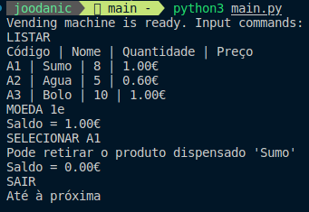

# TPC5 - Máquina de Vending

# João Carvalho, A94015  

## Resumo
Construir um analisador lexico para interpretar comandos de uma maquina de vending. O analisador deve ser capaz de processar comandos como o seguinte:
- `LISTAR`
- `MOEDA 1e`
- `SELECIONAR A1`
- `SAIR`

## Resultado

O analisador lexico pode ser encontrado em [GitHub](https://github.com/joodanic/PL2024/blob/main/TP5/main.py).  

**Resultado:** 