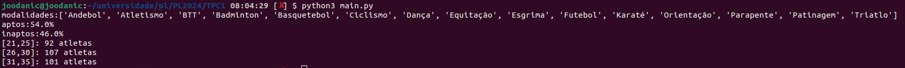

# TPC1

## Resumo

Para este trabalho foi-nos proposto a leitura de um ficheiro CSV, fornecido pela equipa docente, ficheiro este que continha informações relacionadas com atletas de diversas modalidades. Sendo que o objetivo deste trabalho seria o de recolher algumas estatísticas desse mesmo ficheiro.

De forma a conseguir realizar esta tarefa, foi necessária ler o CSV linha a linha, fazer a separação dos diversos campos que este continha, filtrando apenas aqueles que eram úteis para as nossas estatísticas.

As estatísticas pedidas foram as seguintes:

1. Lista ordenada alfabeticamente das modalidades desportivas;
2. Percentagens de atletas aptos e inaptos para a prática desportiva;
3. Distribuição de atletas por escalão etário (escalão = intervalo de 5 anos).

## Resultado

**Resultado:** 

   
   
