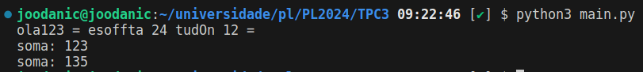

# TPC1

## Resumo

Para este trabalho foi-nos proposto implementar um somador ON/OFF que soma todas as sequencias de digitos num texto, no meu caso o somador comeca a ON, com base nos seguintes criterios:

1. Pretende-se um programa que some todas as sequências de dígitos que encontre num texto;
2. Sempre que encontrar a string “Off” em qualquer combinação de maiúsculas e minúsculas, esse comportamento é desligado;
3. Sempre que encontrar a string “On” em qualquer combinação de maiúsculas e minúsculas, esse comportamento é novamente ligado;
4. Sempre que encontrar o caráter “=”, o resultado da soma é colocado na saída.

## Resultado

**Resultado:** 

   
   
