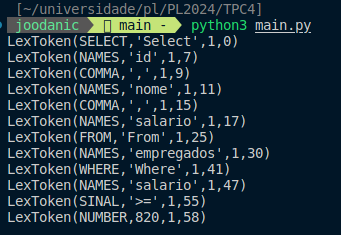

# TPC4

## Resumo
Construir um analisador léxico para interpretar comandos de uma linguagem de query. O analisador deve ser capaz de processar comandos como o seguinte:
- `Select id, nome, salario From empregados Where salario >= 820`

## Resultado

**Resultado:** 

   
   
