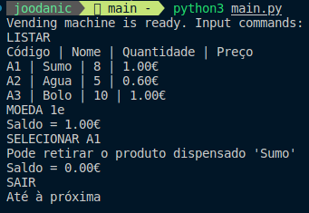

# TPC5

## Resumo
Construir um analisador lexico para interpretar comandos de uma maquina de vending. O analisador deve ser capaz de processar comandos como o seguinte:
- `LISTAR`
- `MOEDA 1e`
- `SELECIONAR A1`
- `SAIR`

## Resultado

**Resultado:** 